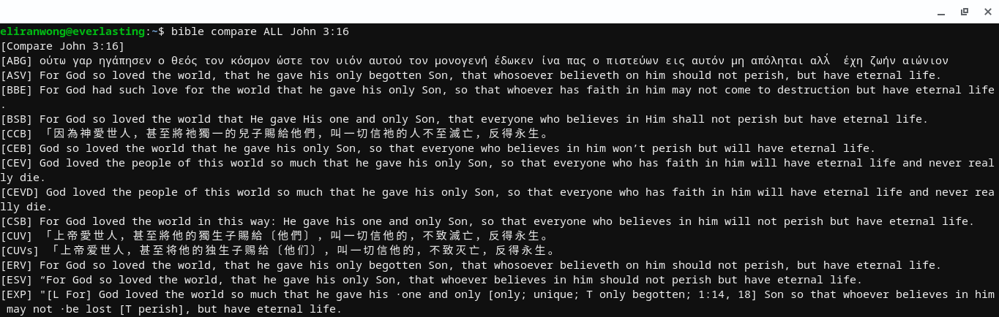

# DartBible
Bible Tools written in <a href="dart.dev">Dart programming language</a>.

Developed from version 2.4.0

# aim
To develop a set of cross-platform codes on bible tools

# objectives
To develop a command line version of bible app

To develop a cross-platform mobile app 
Materials for building mobile apps are placed separately at <a href="https://github.com/eliranwong/DartBible-Flutter">https://github.com/eliranwong/DartBible-Flutter</a>

# Manual

At the moment , you may try commands like:

To "open" John 3:16 in KJV bible:
* dart bin/main.dart open KJV John 3:16

To "open" multiple verses (e.g. John 3:16-18, Rom 5:8, 3:23, 2Ti 3:14-16, Ge 1:5, 8, 13) in KJV bible:
* dart bin/main.dart open KJV John 3:16-18, Rom 5:8, 3:23, 2Ti 3:14-1, Ge 1:5, 8, 13

To "search" for verses containing "Christ Jesus":
* dart bin/main.dart search KJV Christ Jesus

To "search" with standard regular expressions, e.g.:
* dart bin/main.dart search KJV Christ.*?Jesus

To "compare" John 3:16 in all installed bibles:
* dart bin/main.dart compare ALL John 3:16

To "compare" John 3:16 only in NET and KJV:
* dart bin/main.dart compare NET_KJV John 3:16

To "compare" multiple entries, e.g.:
* dart bin/main.dart compare ALL John 3:16, Rom 5:8
* dart bin/main.dart compare NET_KJV_WEB John 3:16, Rom 5:8

To display chapter John 3 in "parallel" modes, with verse 16 highlighted (e.g. NET & KJV):
* dart bin/main.dart parallel NET_KJV John 3:16

To display cross-"reference" verse(s) related to John 3:16 in KJV bible:
* dart bin/main.dart reference KJV John 3:16

<i><b>Remarks:</b></i>
* Please use "," instead of ";" to separate verses in command lines.
* Common abbreviations are supported.
* Please note the difference between "compare" and "parallel".
* "compare" accepts multiple entries of verse references whereas "parallel" ignores.
* "parallel" displays a full chapter with a particular verse highlighted whereas "compare" shows particular verse(s) only.
* "parallel" can use no more than 2 versions [at the moment] whereas "compare" can use as many as installed versions.
* Regular expression is turned on by default for searching bibles.  Use \ to escape characters like ()[].*? .

# Example - Setup in Linux / Chrome OS

https://github.com/eliranwong/Chrome-OS-Linux/blob/master/unique-bible-app/command-line.md

# siblings
For offline desktop version, we have:
UniqueBible.app at <a href="https://github.com/eliranwong/UniqueBible">https://github.com/eliranwong/UniqueBible</a>.

For online versions, iOS app, ...
Visit <a href="https://BibleTools.app">https://BibleTools.app</a> for more apps / information.
